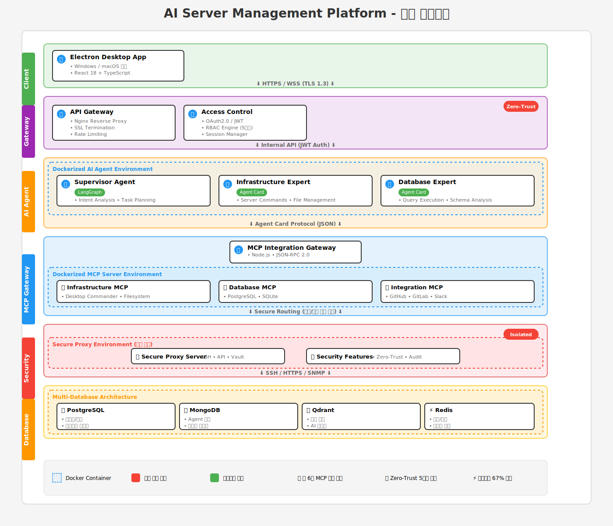

# AI Agent Project - AI 기반 서버 관리 플랫폼

## 🚀 프로젝트 개요

AI 에이전트를 활용한 차세대 서버 관리 플랫폼입니다. Zero-Trust 보안 모델과 LangGraph 기반 AI 오케스트레이션을 통해 안전하고 지능적인 서버 관리를 실현합니다.

### 핵심 특징
- 🔐 **Zero-Trust 보안 모델**: AI 에이전트는 실제 접속 정보를 전혀 모름
- 🤖 **LangGraph AI**: Supervisor-Expert 아키텍처로 복잡한 작업 수행
- 📇 **Agent Card 시스템**: 표준화된 에이전트 간 통신 프로토콜
- ⚡ **MCP 통합**: 6개의 검증된 오픈소스 MCP 서버 활용
- 🛡️ **5계층 보안**: 다층 방어 체계로 엔터프라이즈급 보안
- 📊 **AI 모니터링**: 지능형 이상 징후 자동 탐지

## 🏗️ 시스템 아키텍처

### 정적 아키텍처 다이어그램


### 인터랙티브 아키텍처 (React 컴포넌트)
프로젝트에는 인터랙티브한 React 기반 아키텍처 다이어그램도 포함되어 있습니다:
- 📍 위치: [`docs/architecture/ai-server-architecture-diagram.tsx`](./docs/architecture/ai-server-architecture-diagram.tsx)
- 🎯 특징:
  - 레이어별 상세 정보 토글
  - 데이터 플로우 시각화
  - Agent Card 통신 예시
  - 기술 스택 상세 정보

#### React 컴포넌트 사용 방법

**1. 온라인에서 보기 (CodeSandbox)**
```
1. https://codesandbox.io/s/new 접속
2. React 템플릿 선택
3. lucide-react 설치: npm install lucide-react
4. App.js에 컴포넌트 코드 복사
```

**2. 로컬에서 실행하기**
```bash
# React 앱 생성
npx create-react-app ai-architecture-viewer
cd ai-architecture-viewer

# 필요한 패키지 설치
npm install lucide-react

# src/App.js 파일을 열고 컴포넌트 코드 복사 후 붙여넣기
# 그리고 실행
npm start
```

**3. 기존 React 프로젝트에서 사용**
```jsx
// 컴포넌트 파일을 복사하여 프로젝트에 추가
import ArchitectureDiagram from './components/ArchitectureDiagram';

// 사용
<ArchitectureDiagram />
```

### 아키텍처 구성 요소

#### 1. **클라이언트 계층**
- Electron + React 크로스플랫폼 데스크톱 앱
- Windows/macOS 네이티브 기능 지원
- WebSocket 기반 실시간 통신

#### 2. **API Gateway 계층**
- Nginx 리버스 프록시 (SSL 터미네이션)
- JWT/OAuth2 인증 시스템
- 5단계 RBAC 권한 관리
- Rate Limiting & DDoS 방어

#### 3. **애플리케이션 계층**
- FastAPI (Python 3.11) 백엔드
- LangGraph 기반 AI 에이전트 오케스트레이션
- Supervisor Agent + 5개 도메인 Expert Agents
- 관리자 승인 워크플로우

#### 4. **Agent Card 시스템**
- 표준화된 JSON 기반 통신 프로토콜
- 디지털 서명 및 암호화
- 지능형 라우팅 및 부하 분산
- 5단계 승인 엔진

#### 5. **MCP Integration Gateway**
- Desktop Commander: 파일/명령어/프로세스 관리
- PostgreSQL MCP: 데이터베이스 관리
- GitHub/GitLab MCP: DevOps 워크플로우
- Slack MCP: 알림 및 협업

#### 6. **Secure Proxy 계층**
- 완전 격리된 보안 환경
- SSH/API/SNMP 핸들러
- HashiCorp Vault 연동
- 모든 작업 감사 로깅

#### 7. **데이터베이스 계층**
- PostgreSQL: 트랜잭션 데이터
- MongoDB: 로그 및 비정형 데이터
- Qdrant: AI 벡터 검색
- Redis: 세션 및 캐시
- InfluxDB: 시계열 메트릭
- HashiCorp Vault: 자격증명 관리

#### 8. **모니터링 계층**
- Prometheus + Grafana: 메트릭 및 대시보드
- ELK Stack: 중앙집중식 로깅
- Jaeger: 분산 추적
- AI 기반 이상 징후 탐지

## 📊 주요 성과 지표

- **개발 기간**: 67% 단축 (6개월 → 2개월)
- **MCP 활용**: 18개 커스텀 → 6개 기존 MCP
- **보안 강화**: Zero-Trust 5계층 방어
- **확장성**: 플러그인 방식 아키텍처

## 🛠️ 기술 스택

### Backend
- Python 3.11 + FastAPI
- LangGraph (AI 오케스트레이션)
- Node.js (MCP Gateway)
- Docker Compose

### Frontend
- Electron + React
- TypeScript + Tailwind CSS
- Zustand (상태 관리)
- WebSocket (실시간 통신)

### Database
- PostgreSQL, MongoDB, Qdrant
- Redis, InfluxDB, HashiCorp Vault

### DevOps
- Docker + Docker Compose
- GitLab CI/CD + GitHub Actions
- Prometheus + Grafana

## 🚦 프로젝트 상태

현재 설계 단계가 완료되었으며, 구현을 준비 중입니다.

### 완료된 설계 문서
1. ✅ 프로젝트 디렉토리 구조
2. ✅ 레이어별 상세 설계도
3. ✅ Agent Card 시스템
4. ✅ 보안 플로우 차트
5. ✅ 데이터베이스 스키마 설계
6. ✅ MCP 통합 전략
7. ✅ 배포 아키텍처
8. ✅ 모니터링 스택 설계

## 📁 프로젝트 구조

```
ai-agent-project/
├── docs/
│   └── architecture/
│       ├── ai-server-architecture.svg          # 정적 기술 아키텍처 다이어그램
│       └── ai-server-architecture-diagram.tsx  # 인터랙티브 React 다이어그램
├── README.md                                   # 프로젝트 문서
└── ...
```

### 📊 아키텍처 문서 설명

- **ai-server-architecture.svg**: 전체 시스템의 기술 아키텍처를 보여주는 정적 다이어그램
- **ai-server-architecture-diagram.tsx**: 인터랙티브 기능이 포함된 React 컴포넌트
  - 레이어별 상세 정보 확인
  - 데이터 플로우 시각화
  - 보안 플로우 이해
  - Agent Card 통신 예시

## 🤝 기여하기

이 프로젝트는 현재 개발 초기 단계입니다. 기여를 원하시는 분은 이슈를 생성해주세요.

## 📄 라이선스

이 프로젝트는 MIT 라이선스를 따릅니다.

---

**Built with ❤️ by IT Easy Ops Dev Team**